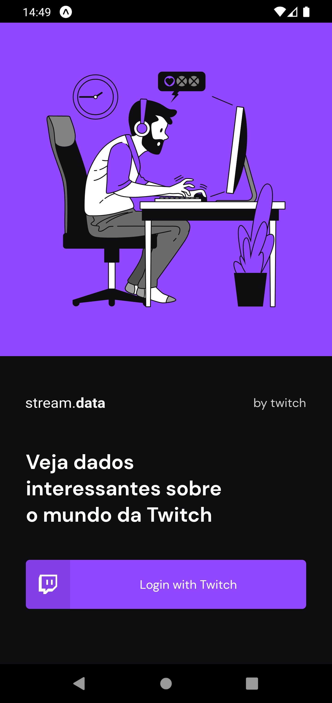
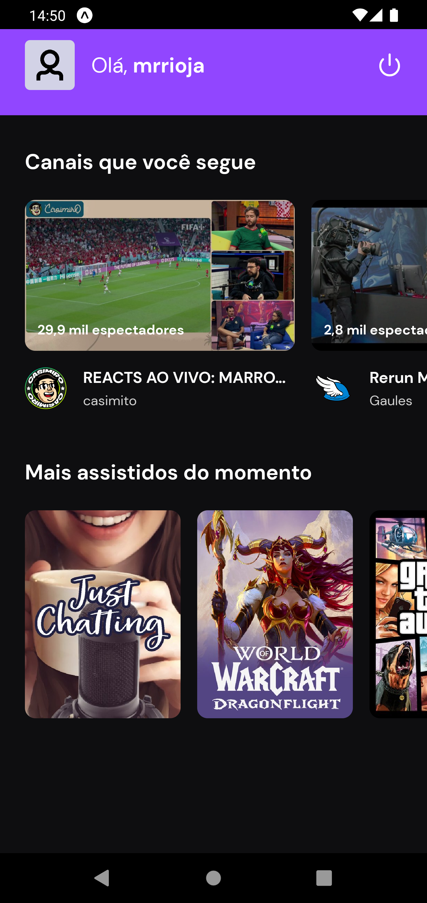
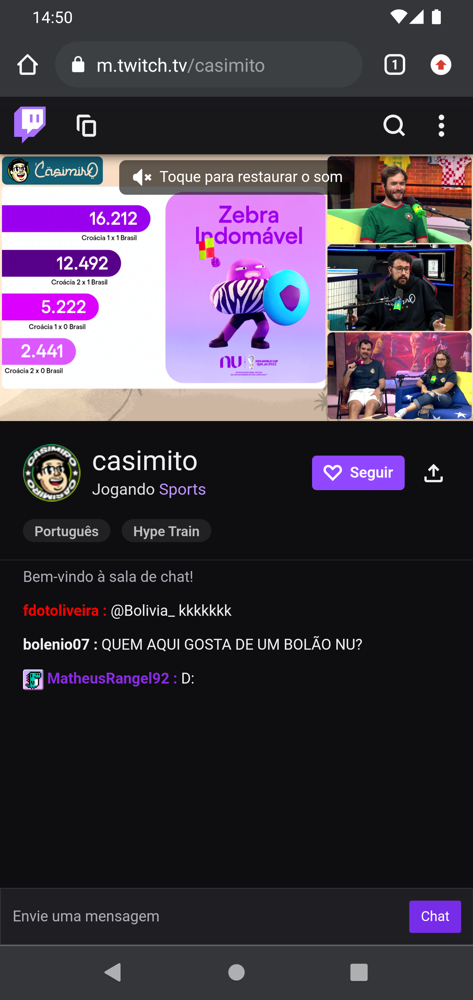

<p align="center">
  
  <br>
</p>
<h3 align="center">
Você por dentro de tudo que rola na Twitch!
</h3>

<br><br>

<p align="center">
  
  
  
  
</p>

<p align="center">
  <a href="#sobre">Sobre</a> •
  <a href="#streamdata">StreamData</a> •
  <a href="#instalação">Instalação</a> •
  <a href="#tecnologias">Tecnologias</a> •
  <a href="#autor">Autor</a>  
</p>

<br>

## Sobre

Projeto desenvolvido durante o bootcamp Ignite da RocketSeat na trilha de React Native cujo objetivo foi colocar em prática os ensinamentos do curso e consolidar as habilidades de construção de aplicativos móveis.

## StreamData

O StreamData é um app que busca, através do consumo da API da Twitch, deixar seus usuário atualizados de tudo que rola na plataforma, incluindo canais seguidos pelo usuário e conteúdos em alta.

Como a API da roxinha é consumida, é imprescindível que o usuário realize o login na aplicação utilizando a sua conta da Twitch, conforme ilustrado abaixo:



Trazer os canais seguidos que estão ao vivo e os conteúdos em alta são os motivos que justificam o login social e, após o login, o usuário terá essas informações na home similar a tela abaixo:



Pronto! Com os canais ao vivo e os conteúdos em alta sendo exibidos, cabe o usuário escolher o que deseja assistir no momento e clicar no seu respectivo card, o qual irá direciona-lo para a Twitch em seu navegador, como podemos ver abaixo:



Deixo a seguir um GIF para mostrar a aplicação em funcionamento e mostrar por completo os fluxos possíveis dentro do app:


## Instalação

Antes de começar, você vai precisar ter instalado em sua máquina as seguintes ferramentas:
[Git](https://git-scm.com), [Node.js](https://nodejs.org/en/).
Além disso é bom ter um editor para trabalhar com o código como [VSCode](https://code.visualstudio.com/).

### 📱 Rodando o App (Mobile)

```bash
# Clone este repositório
$ git clone git@github.com:MrRioja/streamData.git

# Acesse a pasta do projeto no terminal/cmd
$ cd streamData

# Instale as dependências
$ npm install
# Caso prefira usar o Yarn execute o comando abaixo
$ yarn

# Execute a aplicação
$ expo start

# Será aberto no terminal o menu do Expo onde poderá scanear o QR Code para executar o app diretamente no seu celular ou as opções de executar no emulador android ou iOS
```

## Tecnologias


<br><br><br><br>

## Autor

<div align="center">

<h1>Luiz Rioja</h1>
<strong>Backend Developer</strong>
<br/>
<br/>

<a href="https://linkedin.com/in/luizrioja" target="_blank">

</a>

<a href="https://github.com/mrrioja" target="_blank">

</a>

<a href="mailto:lulyrioja@gmail.com?subject=Fala%20Dev" target="_blank">

</a>

<a href="https://api.whatsapp.com/send?phone=5511933572652" target="_blank">

</a>

<a href="https://join.skype.com/invite/tvBbOq03j5Uu" target="_blank">

</a>

<br/>
<br/>
</div>
